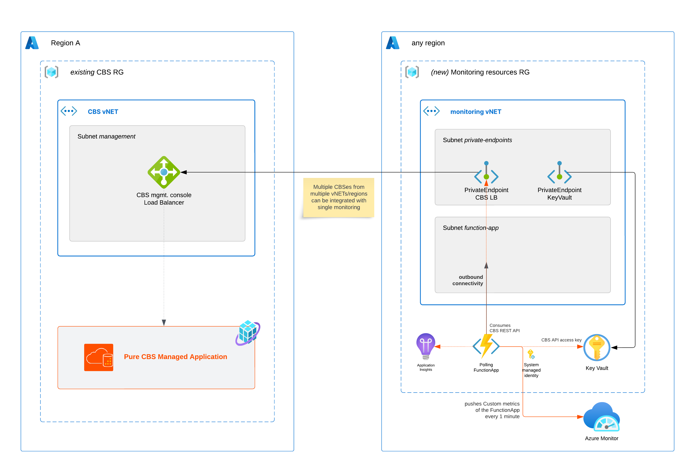
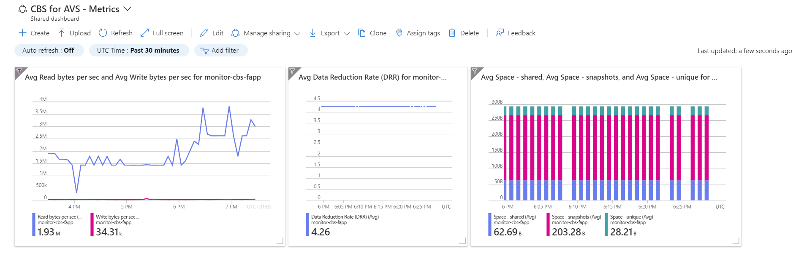
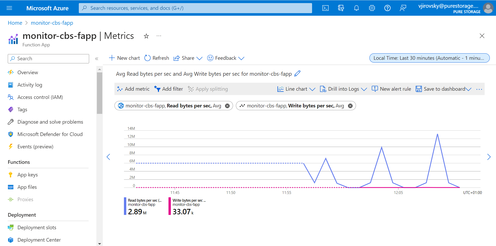

# Sample - Forwarding CBS Metrics to Azure Monitor Agent

This README provides instructions on how to forward metrics from CBS (Cloud Block Store) to Azure Monitor using Azure FunctionApp. The app utilizes an Azure Function that polls data from the CBS REST API and pushes it to Azure Monitor as Custom Metrics of the FunctionApp.

## Prerequisites

Before getting started, ensure you have the following prerequisites:

- CBS is set up and running
- Access to the CBS REST API

The sample Azure Function code is written in C#, .NET8.

## Installation

In this repository, you will find a folder named `IaC`. This folder contains Azure Bicep templates for the Azure Function App and related resources, including a test Azure Monitor Dashboard, KeyVault, AppInsights, and Private Endpoints. These resources enable secure communication via vNET with all resources.

To deploy these resources, follow the steps below:

1. In CBS, create a user with *Reader* permission level and obtain the API key.
2. Clone the repository to your local machine.
3. Navigate to the project directory.
4. Create a `parameters.sh` file based on the `parameters.sh.example` file and update all the values.
5. Run the `./init.sh` script.

After the initial deployment, to publish a new version of your Azure Function code base, simply run the `deploy-function-app.sh` script.

## Usage

The agent Azure Function have a function, executed every minute automatically. This function downloads every minute a current values from CBS REST API and pushes them as a Custom Metrics of itself, from where you can consume them in Azure Monitor.

You can customize the sample app according to your requirements by modifying the `FunctionApp/SendEveryMinuteMetricFunction.cs` file.

## Contributing

We welcome contributions to improve the sample app. If you would like to contribute, please follow the guidelines below:

1. Fork the repository and create a new branch for your changes.
2. Make your changes and commit them to your branch.
3. Push your changes to your forked repository.
4. Submit a pull request with a descriptive title and detailed information about your changes.

Our team will review your contribution and provide feedback. Thank you for contributing!

## License

The sample app is licensed under the [MIT License](https://opensource.org/licenses/MIT). Please review the license file for more information.

## Disclaimer

*The sample script and documentation are provided AS IS and are not supported by
the author or the author's employer, unless otherwise agreed in writing. You bear
all risk relating to the use or performance of the sample script and documentation.* 

*The author and the author's employer disclaim all express or implied warranties
(including, without limitation, any warranties of merchantability, title, infringement
or fitness for a particular purpose). In no event shall the author, the author's employer
or anyone else involved in the creation, production, or delivery of the scripts be liable
for any damages whatsoever arising out of the use or performance of the sample script and
documentation (including, without limitation, damages for loss of business profits,
business interruption, loss of business information, or other pecuniary loss), even if
such person has been advised of the possibility of such damages.*

## Authors

- [Vaclav Jirovsky](https://blog.vjirovsky.cz)
