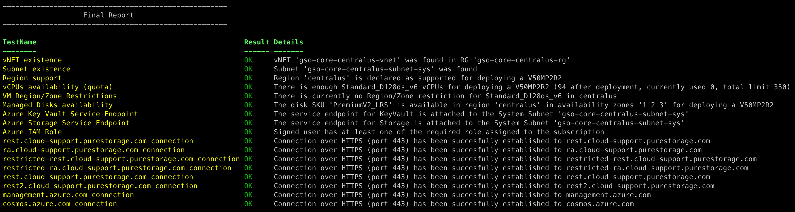

# Azure Pre-Deployment Checklist for Cloud Block Store



## Usage

To run this PowerShell script, make sure you are signed in to your Azure account. Alternatively, use can Azure Cloud Shell.

By default a VM Name will be autogenerated, if you need to change the name or add tags please use `tempVMName` or `tempVmTags` attributes

By default the VM will be deployed with an Ubuntu OS and the Standard_B1s vm size. if you need to change the OS or Size please use `tempVmOS` and `tempVmSize` attributes

### Option 1 - Use Azure Cloud Shell

1. Open a Azure Cloud Shell console and make sure you have selected a Powershell runtime (by default the Azure Cloud Shell starts in Bash runtime)

1. Download the script from GitHub (alternatively you can upload manually via Download/Upload files feature)

```powershell
wget https://raw.githubusercontent.com/PureStorage-OpenConnect/cloudblockstore-scripts/main/CBS-Azure-Solutions/pre-deployment-checklist/paz-checklist.ps1
```

1. Replace placeholders (subscription ID, vNET name,...) in the following command example and execute the script

```powershell
./paz-checklist.ps1 -subscriptionId "<<SUBSCRIPTION-ID>>" -cbsModel "V20MP2R2" -cbsVNETName "<<CBS-VNET-NAME>>" -vnetSystemSubnetName "<<SYSTEM-SUBNET-NAME>>"
```

### Option 2 - Local machine

1. Install Azure Powershell Module
1. Login into Azure:

```powershell
Connect-AzAccount
```

1. Replace placeholders (subscription ID, vNET name,...) in the following command example and execute the script

```powershell
./paz-checklist.ps1 -subscriptionId "<<SUBSCRIPTION-ID>>" -cbsModel "V20MP2R2" -cbsVNETName "<<CBS-VNET-NAME>>" -vnetSystemSubnetName "<<SYSTEM-SUBNET-NAME>>"
```

This script will validate and verify the following:

- Check if the region where VNET is created is supported for CBS deployments.
- Check if the region has enough DSv3 or EbdsV5 Family vCPU to deploy Cloud Block Store.
- Check if the PremiumV2 or Ultra Disks are available and in which Availability Zone.
- Check if the System Subnet has outbound internet access to Pure1 cloud.
- Check if the Signed In User has the required Azure Role Assignment.

CHANGELOG

- 08/20/25  3.0.8  Updated for Better Error Handling and Update fo VM Images
- 01/07/25  3.0.7 From v6.8.2 is not used CosmosDB anymore
- 10/24/24  3.0.6 Disable Storage Account Creation for Boot Diagnostics
- 8/30/2024 3.0.5 Bug Fixes for V10MP2R2
- 7/15/2024 3.0.4 Updated Region Support, V10MP2R2
- 7/11/2024 3.0.3 Added Microsoft.Storage Endpoint, Fixed naming of the LB
- 6/6/2024  3.0.2 Added ability to modify VM Size and VM OS types
- 3/15/2024 3.0.1 Improved test for outbound connectivity (to deploy a test load balancer)
- 3/12/2024 3.0.0 Script refactored, to provide a full report of the readiness of the environment for CBS deployment
- 1/26/2024 2.0.1 Adding V20MP2R2 and PremiumV2 SSD support to the script
